# Learning Map — Communication-Efficient Learning of Deep Networks from Decentralized Data

> Three-graph interactive learning surface for [arxiv:1602.05629](https://arxiv.org/abs/1602.05629).

Anyone — total math novice to senior researcher — can enter at their skill level and walk the dependency graph forward to the paper and into the proposed extensions. Every concept has prose + formal math + runnable code.

## Pick your entry point

| Skill level | Start here |
|-------------|------------|
| Total beginner (no math) | [Foundations: novice tour](https://github.com/pleyva2004/math-foundations/blob/main/tours/novice.md) |
| Calc + linear algebra | [Foundations: CS undergrad tour](https://github.com/pleyva2004/math-foundations/blob/main/tours/cs-undergrad.md) |
| Measure theory | [Foundations: math grad tour](https://github.com/pleyva2004/math-foundations/blob/main/tours/math-grad.md) |
| Domain researcher | [Paper graph](./paper/README.md) |
| Reviewer / brainstorm partner | [Improvements graph](./improvements/README.md) |

## Combined graph

```mermaid
flowchart TD
  F03["partition of a set"]
  F08["hessian"]
  F10["convex function"]
  F11["jensens inequality"]
  F09["covariance"]
  F06["gradient descent"]
  F02["empirical risk"]
  F04["unbiased estimator"]
  F01["expectation"]
  F12["permutation group"]
  F07["taylor theorem"]
  F05["gradient"]
  F13["control variates"]
  F14["horvitz thompson estimator"]
  F16["low rank factorization"]
  F15["linear assignment problem"]
  P01["01 Finite-Sum Objective"]
  P02["02 Client-Partition Decomposition"]
  P03["03 IID vs Non-IID"]
  P04["04 FedSGD as Exact Gradient Descent"]
  P05["05 Gradient- vs Model-Averaging Equivalence"]
  P06["06 FedAvg: Iterated Local Steps"]
  P07["07 Local-Update Count u=nE/(KB)"]
  P08["08 Heterogeneity Gap = eta^2 Cov_k(H_k,g_k)"]
  P09["09 Client-Sampling Unbiasedness (Horvitz-Thompson)"]
  P10["10 Aggregation Erratum: normalize by m_t"]
  P11["11 Parameter Averaging & Jensen"]
  P12["12 Shared-Init & the Permutation Barrier"]
  I01["01 Control-Variate Drift Correction"]
  I02["02 Unbiased Aggregation Estimators"]
  I03["03 Adaptive Local-Work Schedule"]
  I04["04 Compute-Accounting Pareto (design)"]
  I05["05 Permutation-Aligned Averaging (Git Re-Basin for FL)"]
  I06["06 Federated LoRA (design)"]
  F01 --> P01
  F02 --> P01
  P01 --> P02
  F03 --> P02
  P02 --> P03
  F04 --> P03
  P02 --> P04
  F05 --> P04
  F06 --> P04
  P04 --> P05
  P05 --> P06
  P06 --> P07
  P06 --> P08
  F07 --> P08
  F08 --> P08
  F09 --> P08
  P03 --> P09
  P04 --> P09
  F04 --> P09
  P09 --> P10
  P02 --> P11
  F10 --> P11
  F11 --> P11
  P11 --> P12
  F12 --> P12
  P08 --> I01
  P06 --> I01
  F13 --> I01
  P10 --> I02
  P09 --> I02
  F14 --> I02
  P07 --> I03
  P08 --> I03
  P07 --> I04
  P12 --> I05
  F12 --> I05
  F15 --> I05
  P04 --> I06
  P06 --> I06
  F16 --> I06
  click P01 "paper/concepts/01-finite-sum-objective.md"
  click P02 "paper/concepts/02-client-partition-decomposition.md"
  click P03 "paper/concepts/03-iid-noniid-dichotomy.md"
  click P04 "paper/concepts/04-fedsgd-gradient-descent.md"
  click P05 "paper/concepts/05-gradient-model-averaging-equivalence.md"
  click P06 "paper/concepts/06-fedavg-local-iteration.md"
  click P07 "paper/concepts/07-local-update-count.md"
  click P08 "paper/concepts/08-heterogeneity-gap-covariance.md"
  click P09 "paper/concepts/09-client-sampling-unbiasedness.md"
  click P10 "paper/concepts/10-aggregation-erratum.md"
  click P11 "paper/concepts/11-parameter-averaging-jensen.md"
  click P12 "paper/concepts/12-shared-init-permutation-barrier.md"
  click I01 "improvements/concepts/01-control-variate-drift-correction.md"
  click I02 "improvements/concepts/02-unbiased-aggregation-estimators.md"
  click I03 "improvements/concepts/03-adaptive-local-work-schedule.md"
  click I04 "improvements/concepts/04-compute-accounting-pareto.md"
  click I05 "improvements/concepts/05-permutation-aligned-averaging.md"
  click I06 "improvements/concepts/06-federated-lora-communication.md"
  click F01 "https://github.com/pleyva2004/math-foundations/blob/main/concepts/expectation.md"
  click F02 "https://github.com/pleyva2004/math-foundations/blob/main/concepts/empirical-risk.md"
  click F03 "https://github.com/pleyva2004/math-foundations/blob/main/concepts/partition-of-a-set.md"
  click F04 "https://github.com/pleyva2004/math-foundations/blob/main/concepts/unbiased-estimator.md"
  click F05 "https://github.com/pleyva2004/math-foundations/blob/main/concepts/gradient.md"
  click F06 "https://github.com/pleyva2004/math-foundations/blob/main/concepts/gradient-descent.md"
  click F07 "https://github.com/pleyva2004/math-foundations/blob/main/concepts/taylor-theorem.md"
  click F08 "https://github.com/pleyva2004/math-foundations/blob/main/concepts/hessian.md"
  click F09 "https://github.com/pleyva2004/math-foundations/blob/main/concepts/covariance.md"
  click F10 "https://github.com/pleyva2004/math-foundations/blob/main/concepts/convex-function.md"
  click F11 "https://github.com/pleyva2004/math-foundations/blob/main/concepts/jensens-inequality.md"
  click F12 "https://github.com/pleyva2004/math-foundations/blob/main/concepts/permutation-group.md"
  click F13 "https://github.com/pleyva2004/math-foundations/blob/main/concepts/control-variates.md"
  click F14 "https://github.com/pleyva2004/math-foundations/blob/main/concepts/horvitz-thompson-estimator.md"
  click F15 "https://github.com/pleyva2004/math-foundations/blob/main/concepts/linear-assignment-problem.md"
  click F16 "https://github.com/pleyva2004/math-foundations/blob/main/concepts/low-rank-factorization.md"
  classDef paper fill:#cce5ff,stroke:#3399ff;
  classDef imp fill:#ffe0b3,stroke:#ff9933;
  classDef fnd fill:#e0e0e0,stroke:#888,color:#333;
  class P01,P02,P03,P04,P05,P06,P07,P08,P09,P10,P11,P12 paper;
  class I01,I02,I03,I04,I05,I06 imp;
  class F01,F02,F03,F04,F05,F06,F07,F08,F09,F10,F11,F12,F13,F14,F15,F16 fnd;
```

Grey nodes = foundations (clicks out to the shared foundations repo).
Blue nodes = paper-specific (this study).
Orange nodes = proposed extensions (this study).

## Sub-graphs

- [Paper graph](./paper/README.md) — concepts the paper itself defines or uses
- [Improvements graph](./improvements/README.md) — concepts from the proposed extensions
- [Foundations graph (shared)](https://github.com/pleyva2004/math-foundations) — prerequisites referenced by stable URL

## Interactive views

- **Mermaid** (this README) — clickable in GitHub's browse view.
- **Jupyter notebook** — [`notebook/combined.ipynb`](./notebook/combined.ipynb) — runnable cells.
- **HTML force graph** — [`html/index.html`](./html/index.html) — drag, zoom, filter by level.

## Code-in-line guarantee

Every concept node — in every graph — has an aligned `.py` file in `code/<NN>-<slug>.py`. No exceptions, including abstract concepts (which get a finite/discrete witness).
