# Improvements Graph — proposed extensions

Concepts from the proposed extensions in [`../../05-improvements.tex`](../../05-improvements.tex). Each improvement node prereqs ≥1 paper node (blue) it extends.

```mermaid
flowchart TD
  I01["01 Control-Variate Drift Correction"]
  I02["02 Unbiased Aggregation Estimators"]
  I03["03 Adaptive Local-Work Schedule"]
  I04["04 Compute-Accounting Pareto (design)"]
  I05["05 Permutation-Aligned Averaging (Git Re-Basin for FL)"]
  I06["06 Federated LoRA (design)"]
  P04["paper: FedSGD as Exact Gradient Descent"]
  P06["paper: FedAvg: Iterated Local Steps"]
  P07["paper: Local-Update Count u=nE/(KB)"]
  P08["paper: Heterogeneity Gap = eta^2 Cov_k(H_k,g_k)"]
  P09["paper: Client-Sampling Unbiasedness (Horvitz-Thompson)"]
  P10["paper: Aggregation Erratum: normalize by m_t"]
  P12["paper: Shared-Init & the Permutation Barrier"]
  F13["control variates"]
  F15["linear assignment problem"]
  F16["low rank factorization"]
  F12["permutation group"]
  F14["horvitz thompson estimator"]
  P08 --> I01
  P06 --> I01
  F13 --> I01
  P10 --> I02
  P09 --> I02
  F14 --> I02
  P07 --> I03
  P08 --> I03
  P07 --> I04
  P12 --> I05
  F12 --> I05
  F15 --> I05
  P04 --> I06
  P06 --> I06
  F16 --> I06
  click I01 "concepts/01-control-variate-drift-correction.md"
  click I02 "concepts/02-unbiased-aggregation-estimators.md"
  click I03 "concepts/03-adaptive-local-work-schedule.md"
  click I04 "concepts/04-compute-accounting-pareto.md"
  click I05 "concepts/05-permutation-aligned-averaging.md"
  click I06 "concepts/06-federated-lora-communication.md"
  click P06 "../paper/concepts/06-fedavg-local-iteration.md"
  click P10 "../paper/concepts/10-aggregation-erratum.md"
  click P07 "../paper/concepts/07-local-update-count.md"
  click P08 "../paper/concepts/08-heterogeneity-gap-covariance.md"
  click P09 "../paper/concepts/09-client-sampling-unbiasedness.md"
  click P04 "../paper/concepts/04-fedsgd-gradient-descent.md"
  click P12 "../paper/concepts/12-shared-init-permutation-barrier.md"
  click F13 "https://github.com/pleyva2004/math-foundations/blob/main/concepts/control-variates.md"
  click F15 "https://github.com/pleyva2004/math-foundations/blob/main/concepts/linear-assignment-problem.md"
  click F16 "https://github.com/pleyva2004/math-foundations/blob/main/concepts/low-rank-factorization.md"
  click F12 "https://github.com/pleyva2004/math-foundations/blob/main/concepts/permutation-group.md"
  click F14 "https://github.com/pleyva2004/math-foundations/blob/main/concepts/horvitz-thompson-estimator.md"
  classDef imp fill:#ffe0b3,stroke:#ff9933;
  classDef paper fill:#cce5ff,stroke:#3399ff;
  classDef fnd fill:#e0e0e0,stroke:#888,color:#333;
  class I01,I02,I03,I04,I05,I06 imp;
  class P04,P06,P07,P08,P09,P10,P12 paper;
  class F13,F15,F16,F12,F14 fnd;
```

Grey = foundations (click → shared repo). Each node links to its concept page; the aligned runnable witness is in `code/<NN>-<slug>.py`.
