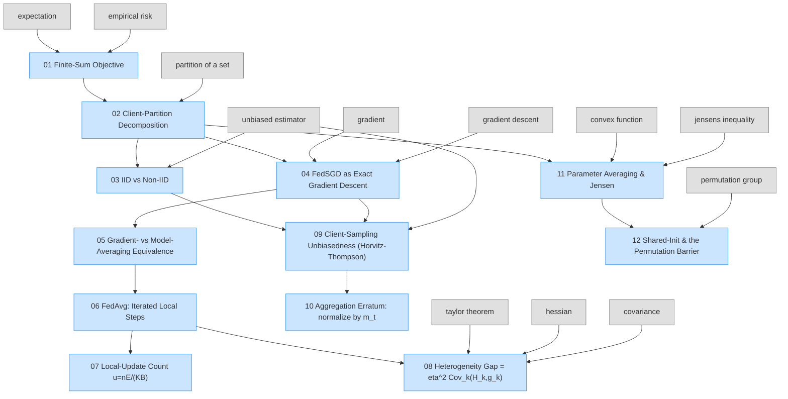

# Paper Graph — FedAvg concepts

Concepts the paper itself defines or uses, in dependency order, derived from [`../../02-math-deep-dive.md`](../../02-math-deep-dive.md). 12 nodes, each with a prose page + runnable witness. arXiv:[1602.05629](https://arxiv.org/abs/1602.05629).

Grey = foundations (click → shared repo). Each node links to its concept page; the aligned runnable witness is in `code/<NN>-<slug>.py`.
